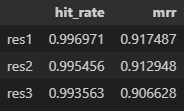

# llm-computer-science-theory-qa

# Index
- [Project Overview](#project-overview)
- [Technologies](#technologies)
- [Setup](#setup)
- [How to use it](#how-to-use-it)
- [Details of the project](#details-of-the-project)

# Project Overview

This project centers on building a chatbot capable of answering computer science or data science interview questions. The bot's responses are based on intents derived from the [Computer Science Dataset](https://www.kaggle.com/datasets/mujtabamatin/computer-science-theory-qa-dataset) and [500 Data Science Interview Questions and Answers by Vamsee Puligadda
](https://www.kobo.com/us/es/ebook/500-data-science-interview-questions-and-answers?srsltid=AfmBOoqgwhGfV3MCxYC-YhUD98bP_-yQUTSM51PPpohxc-f-sYy3Rchr).

The chatbot uses a Retrieval-Augmented Generation (RAG) system to deliver the most relevant answers and is accessible through a user-friendly app. It includes experiments to evaluate the best retrieval and RAG approaches, as well as a monitoring dashboard to track costs, model performance, and response times.

# Technologies:
- **Azure OpenAI**: main llm and embedding
- **Ollama**: secondary llms
- **SentenceTransformers**: secondary embedding models
- **ElasticSearch**: VectorDatabase
- **Grafana and PostGres DB**: Monitoring
- **Streamlit**: app
- **Python**: programming language
- **Docker and docker-compose or podman**: containers and orchestration
- **Conda**: package management
- **Git and Github**: version control

# Setup

## Anaconda Commands

In the terminal, run:

```bash
conda env create --name <project_name> --file=environment.yaml
```

This creates the environment with all required dependencies. To activate the environment in future sessions, use:
```bash
conda activate <project_name>
```

## Local Env Setup

1. Create Data Directories:

- In the project’s root directory, create a folder named data.
- Inside data, add the JSON dataset from Kaggle.
- Within data, create a books folder, and add the book’s PDF file there.

2. Environment Variables:

- Copy .env_example to a new file named .env.
- Fill in the values as needed, depending on whether you are using ollama/transformers or AzureOpenAI models.
- If using AzureOpenAI, add the necessary API keys, endpoint, and ensure your model deployments are ready. This guide assumes familiarity with these configurations.

3. Start Services with Podman or Docker:

- From the project directory, run the following command:
```bash
podman compose up -d
```
Or, to use Docker Compose:
```bash
docker-compose up -d
```

# How to use it

After setup:

1. Indexing and Preprocessing: run [indexing/\_\_main__.py](src/indexing/__main__.py) to preprocess the book PDF and JSON, unify them into a single JSON, create an index, and index the questions in the Elasticsearch container. Ensure the conda environment is active for this step.
2. Evaluation (Optional): To evaluate the retrieval system, you can use an existing ground truth or generate your own: run[retrieval_evaluation.ipynb](src/evaluation/retrieval_evaluation.ipynb) for evaluation. create a ground truth dataset with [generate_ground_truth.ipynb](src/evaluation/generate_ground_truth.ipynb).
3. Ollama Model Setup (Optional): If using the ollama model, download the gemma:2b model before starting.
4. Access the Streamlit App: With Docker or Podman running, the Streamlit app will be available at `http://localhost:8501`. Visit this URL in your browser to start using the app!

# Details of the project

This project follows the typical structure of a Retrieval-Augmented Generation (RAG) system.

## Knowledge base Creation:

All steps to create and populate the knowledge base are automated via [indexing/\_\_main__.py](src/indexing/__main__.py). The process is organized as follows:

1. Preprocessing:
    - Book Data: Extracts text from PDF files and formats it into a JSON structure with question numbers, text, and answers. [add_pdf_books.ipynb](src/indexing/preprocessing/add_pdf_books.ipynb)
    - Data Unification: Combines book and CS QA JSON files into a unified format. [unify_qa_files.py](src/preprocessing/unify_qa_files.py)
    - Data Cleaning: Removes duplicate questions and answers. [dataset_cleaning.ipynb](src/indexing/preprocessing/dataset_cleaning.ipynb)
    - ID Collision Check: Test unique IDs across entries. [test_qa_id_collisions.py](src/indexing/preprocessing/test_qa_id_collisions.py)
1. Indexing in the Vector Database:
    - Start the Docker containers with `docker compose up`.
    - Execute [indexing_documents.py](src/indexing/indexing_documents.py) which:
        - Creates an index in the vector database (if not already present, or if `ELASTICSEARCH_FORCE_RECREATE=True` in `.env`).
        - Indexes questions and answers in the vector database, using a model defined by `EMBEDDING_CLIENT` in `.env`, or specified directly when initializing the `IndexDocuments` class.

## Evaluation Process

Once documents are indexed, the retrieval system is evaluated as follows:
1. Ground Truth Creation: Generate ground truth data by running [create_ground_truth.ipynb](src/evaluation/create_ground_truth.ipynb). This example uses Azure OpenAI's GPT-4 to create the ground truth, though other models can be used.
2. With [evaluation_ground_truth.csv](data/evaluation_ground_truth.csv) generated, use [retrieval_evaluation](src/evaluation/retrieval_evaluation.ipynb) to assess retrieval quality by measuring cosine similarity between database vectors and user queries. Three methods were tested:

- Method 1: Using the combined vector alone.
- Method 2: Weighted mean, combining 0.5 of the combined vector with 0.25 each of question and answer vectors.
- Method 3: Simple mean of combined, question, and answer vectors.

Evaluation results (below) showed that Method 1 performed best. 

The results were: 

Note: Results were exceptionally accurate due to the similarity of interview questions in this field.

## App and Monitoring

This project features a Streamlit application with a user-friendly interface for submitting questions and providing feedback on the answers. The app includes two buttons for rating responses, though feedback is only enabled once an answer has been given. Upon receiving an answer, the app displays several metrics, including the OpenAI usage cost.

**Key Features**
- **User Interaction:** A simple input field allows users to submit questions, with two feedback buttons to evaluate responses.
- **Answer Metrics:** After each answer, key metrics (e.g., OpenAI API costs) are shown directly on the interface.
- **Data Storage:** All conversations are stored in a PostgreSQL database, with separate tables for conversation history and feedback.
- **Monitoring and Analytics:** Integrated with Grafana dashboards to track metrics like feedback ratings, API costs, and response time.

This app setup provides comprehensive insights into application performance, enabling continuous improvement based on user feedback and usage data.
